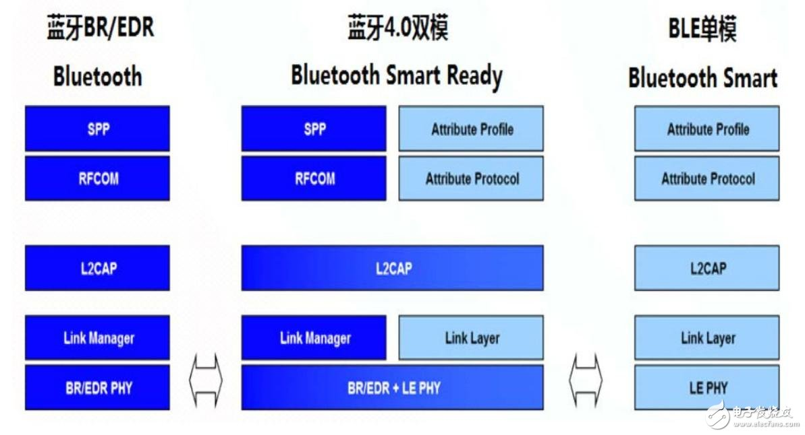

# 蓝牙调研

### 名词解释

1. BLE(Bluetoothlow energy)：低功耗蓝牙，是蓝牙4.0协议中的一部分。蓝牙低能耗无线技术利用许多智能手段最大限度地降低功耗。低功耗蓝牙架构共有两种芯片构成：单模芯片和双模芯片。

	> 一、蓝牙单模器件是蓝牙规范中新出现的一种只支持蓝牙低能耗技术的芯片——是专门针对ULP操作优化的技术的一部分。蓝牙单模芯片可以和其它单模芯片及双模芯片通信，此时后者需要使用自身架构中的蓝牙低能耗技术部分进行收发数据。

	> 二、双模芯片也能与标准蓝牙技术及使用传统蓝牙架构的其它双模芯片通信。

2. BLE和蓝牙4.0：两者并不是一回事，蓝牙4.0包含两个蓝牙标准，一个是双模标准，它包括传统蓝牙（ER、ER+EDR）、高速蓝牙（传统蓝牙+HS)和低功耗蓝牙（BLE）。一个是单模标准，只支持BLE。


	


3. Central：中心设备。

4. Peripheral：外围设备，向周围发送广播数据，告诉周围的中心设备，我这里有数据。中心设备连接上外围设备，就能获取到该设备能提供的服务和特征值。

5. 传统蓝牙可以用于数据量比较大的传输，如语音、音乐、较高数据量的传输等。有三个功耗级别，Class1，Class2，Class3，分别支持100m，10m，1m的传输距离。

6. 低功耗蓝牙用于实时性要求比较高，但是数据传输速率比较低的产品，如遥控类、鼠标、键盘、传感设备的数据发送如心跳带、血压计、温度计等。没有功耗级别，一般在空旷的距离上，达到20m没有问题。

7. BR（Basic Rate），正宗的蓝牙技术。可以包括可选的EDR技术，以及交替使用的MAC(Media Access Control)层和PHY层扩展(简称AMP)。

8. EDR（Enhanced Data Rate）：蓝牙增强速率技术。

9. SSP（Secure simple pairing）：安全简易配对，v2.1版本中采用该配对方式，用户无需再输入配对的PIN码。


### 蓝牙版本

1. v1.X版本的蓝牙技术带有实验性质，较少被生产厂商采用。

2. v2.0+EDR和v1.X主要升级体现在传输速度，实际速度可以达到3Mbps（384KB/s）。但该版本由于配对困难，采用的设备仍然较少，该标准将在14年11月作废。

3. v2.1+EDR和v2.0+EDR的主要升级体现在快速配对技术SSP的采用，即用户无需再输入配对的PIN码。该版本是当前设备数量最多的版本。

4. v3.0+HS根据802.11适配层协议应用了Wi-Fi技术，即在蓝牙配对后，在需要的时候调用802.11 wifi用于实现高速数据。理论上最高速度可达到24Mbps（3MB/s)，是蓝牙2.0的八倍。“+HS”(High Speed)是选配技术，并非所有的Bluetooth 3.0均支持24Mbps的传输速度。（即高速蓝牙）优点像Airdrop，但不是。Airdrop更快。

5. v4.0是v3.0+HS的补充，在“经典规范”(可以看作v2.1的升级)和“高速规范”（+HS）两个标准之上，增加了“低功耗规范（Bluetooth Low Energy）”。

6. 4.1以“internet of things”为目标对v4.0进行的软件升级，在连接性的提升体现在如下方面（硬件层面上v4.0的设备无需做任何改动即可使用v4.1）。

	> 一、v4.1标准下蓝牙设备可以同时作为发射方（Bluetooth Smart）和接受方（Bluetooth Smart Ready），并且可以连接到多个设备。

	> 二、长期睡眠下的自动唤醒功能。例如在佩戴手环游泳1小时后，回到更衣室手环会自动和手机建立连接传输数据，不需要任何操作。

	> 三、通过IPv6建立网络连接。蓝牙设备只需要通过蓝牙4.1连接到可以上网的设备（如手机），就可以通过IPv6与云端的数据进行同步。即实现“云同步”不再需要wifi连接（wifi模块的成本通常更高，也更费电）。 


### BLE传输效率

1. 一个包最多传输的有效数据是20字节。

2. 理论上1s最大可以传输125K字节，但是实际上BLE不能连续不断的传输数据包，否则就不能称之为低功耗蓝牙了。Android手机实际测试5KB/s就是极限了。

3. 在实际的操作过程中，如果主机连线不断地发送数据包，要么丢包严重要么连接出现异常而断开。

4. BLE协议中影响传输的两个因素：

 	> 一、连接间隔。这里的连接与应用层了连接不是一回事（中心设备在外围设备广播时进行连接是应用层的主动软件行为）。这里说的连接间隔完全是由硬件控制，对应用层透明。蓝牙基带是跳频工作的，中心设备和外围设备会约定多长时间进行跳频连接，连接上才能进行数据传输。连接上传完数据后，蓝牙基带即进入休眠状态，保证低功耗。其是1.25毫秒一个单位。

 	> 二、连接延迟。其是为了低功耗考虑，允许外围设备在跳频过程中不理会中心设备的跳频指令，继续睡眠一段时间。而中心设备不能因为外围设备睡眠而认为其断开连接了。其是1.25毫秒一个单位。明显，这个数值越小，传输速度也高。 

5. 实际场景：蓝牙BLE协议规定连接参数最小是5，即7.25毫秒；而Android手机规定连接参数最小是8，即10毫秒。iOS规定是16，即20毫秒。连接参数完全由中心设备决定，但外围设备可以发出更新参数申请，中心设备可以接受也可以拒绝。Android手机一般接受，而iOS比较严格，拒绝的概率比较高。高速会带来连接稳定性的问题，可以通过优化profile的数据交互场景和一些参数。


### 四种设备类型

1. Central：主机，常作为Client端。运用到手机上就是，手机作为主机，连接蓝牙外设，外设提供Service，一台手机最多可以同时连接7个蓝牙模块。

2. Peripheral：从机，常作为Service端。

3. Observer：观察者，扫描广播者，不能够启动连接。

4. Braodcaster：广播发送者，是不可连接的设备。


### 连接过程（按序号步骤进行)

1. Peripheral开启广播

2. Central扫描从机广播

3. Peripheral接收到Central的扫描请求，Peripheral向Central发送扫描回应数据

4. Central向Peripheral发起连接

5. 开始通信

### 6种设备状态

 * 待机状态（standby）：设备没有传输和发送数据，并且没有连接到任何设备。

 * 广播状态（Advertiser）：周期性广播状态。

 * 扫描状态（Scanner）：主动寻找正在广播的设备。

 * 发起链接状态（Initiator）：主动向扫描设备发起连接。

 * 主设备（Master）：作为主设备连接到其他设备。

 * 从设备（Slave）：作为从设备连接到其他设备。

### 5种工作状态

 * 准备（standby）

 * 广播（advertising）

 * 监听扫描（Scanning）

 * 发起连接（Initiating）

 * 已连接（Connected）

### iOS实现

 1. iOS10之后需要在Info.plist中添加 `NSBluetoothPeripheralUsageDescription` 描述。

 2. 前后台执行

 > 只支持前台执行：进入后台之后程序会被挂起，挂起状态下无法处理蓝牙相关业务，直到重新回到前台。最直接的表现是central无法扫描和发现peripheral的广播包；在peripheral端就会表现为停止广播，任何central想访问characteristic的值都将收到异常信息。

 > 后台执行：对于外设端需要在Info.plist中增加 `Required background modes` -> `bluetooth-peripheral`；对于主机端需要在Info.plist中增加 `Required background modes` -> `bluetooth-central`。

 3. 首先是主机端代码


 ```objc

//
//  QXCentralManager.h
//  TestBluetooth
//
//  Created by lawn.cao on 2018/1/31.
//  Copyright © 2018年 lawn. All rights reserved.
//

#import <Foundation/Foundation.h>

@class QXCentralManager;

#pragma mark - 定义回调block

typedef void(^QXCentralBluetoothDidReadyBlock)(QXCentralManager *manager);
typedef void(^QXCentralBluetoothDidConnectBlock)(QXCentralManager *manager);
typedef void(^QXCentralBluetoothDisConnectBlock)(QXCentralManager *manager);
typedef void(^QXCentralBluetoothReceiveDataBlock)(QXCentralManager *manager, NSData *data);


#pragma mark - QXCentralManager

@interface QXCentralManager : NSObject

/// 蓝牙状态处于开启状态，则回调该block，这个时候就可以开启扫描了
@property (nonatomic, copy  ) QXCentralBluetoothDidReadyBlock readyBlock;
/// 连接上外设，并且成功订阅到关注的特征值，才会回调该block，触发数据的发送最好放在该回调中
@property (nonatomic, copy  ) QXCentralBluetoothDidConnectBlock connectBlock;
/// 与外设断开连接，则回调该block
@property (nonatomic, copy  ) QXCentralBluetoothDisConnectBlock disConnectBlock;
/// 读取到外设的数据回调
@property (nonatomic, copy  ) QXCentralBluetoothReceiveDataBlock receiveDataBlock;

/**
 初始化方法

 @param peripheralName 指定要连接的蓝牙外设订阅名称
 @param advertisementName 播发的订阅名称，与设备名称两者需要有一个，用于判断连接哪台设备
 @param serviceUUID 指定关注的外设的服务，其中serviceUUID是长度为32的字符串，用"-"分割，分割规则为8-4-4-4-12，如 123e4567-e89b-12d3-a456-426655440000
 @param readCharacteristicUUID 指定关注的读特性，同serviceUUID的规则一致
 @param writeCharacteristicUUID 指定关注的特性，同serviceUUID的规则一致
 @return 返回QXCentralManager实例
 */
- (instancetype)initWithPeripheralName:(NSString *)peripheralName
                     advertisementName:(NSString *)advertisementName
                           serviceUUID:(NSString *)serviceUUID
                readCharacteristicUUID:(NSString *)readCharacteristicUUID
               writeCharacteristicUUID:(NSString *)writeCharacteristicUUID;


/// 开始扫描，当前仅当蓝牙处于开启状态时，调用该方法有效，一般放在readyBlock中调用
- (void)beginScanPeripheral;

/// 写数据到外设
- (void)writeData:(NSData *)data;

/// 关闭与外设的连接
- (void)stop;

@end


 ```

 ``` objc

 //
//  QXCentralManager.m
//  TestBluetooth
//
//  Created by lawn.cao on 2018/1/31.
//  Copyright © 2018年 lawn. All rights reserved.
//

#import "QXCentralManager.h"
#import <CoreBluetooth/CoreBluetooth.h>


@interface QXCentralManager()<CBCentralManagerDelegate, CBPeripheralDelegate>

/// 主机设备管理
@property (nonatomic, strong) CBCentralManager *centralManager;

/// 指定要连接的蓝牙外设名称
@property (nonatomic, copy  ) NSString *peripheralName;
@property (nonatomic, copy  ) NSString *advertisementName;
@property (nonatomic, copy  ) NSString *serviceUUIDString;
@property (nonatomic, copy  ) NSString *readCharacteristicUUIDString;
@property (nonatomic, copy  ) NSString *writeCharacteristicUUIDString;


/// 指定的外设服务
@property (nonatomic, strong) CBUUID *serviceUUID;
/// 指定的外设的读特性
@property (nonatomic, strong) CBUUID *readCharacteristicUUID;
/// 指定的外设的写特征
@property (nonatomic, strong) CBUUID *writeCharacteristicUUID;

/// 写特征值
@property (nonatomic, strong) CBCharacteristic *writeCharacteristic;

/// 查找发现的外设，持有查找到的外设，防止外设对象被释放
@property (nonatomic, strong) CBPeripheral *discoverPeripheral;

@property (nonatomic, strong) dispatch_queue_t centralQueue;

@end


@implementation QXCentralManager

#pragma mark - Lifecycle Methods

/// 初始化方法
- (instancetype)initWithPeripheralName:(NSString *)peripheralName
                     advertisementName:(NSString *)advertisementName
                           serviceUUID:(NSString *)serviceUUID
                readCharacteristicUUID:(NSString *)readCharacteristicUUID
               writeCharacteristicUUID:(NSString *)writeCharacteristicUUID
{
    self = [super init];
    
    if (self) {
        
        _peripheralName = peripheralName;
        _advertisementName = advertisementName;
        _serviceUUIDString = serviceUUID;
        _readCharacteristicUUIDString = readCharacteristicUUID;
        _writeCharacteristicUUIDString = writeCharacteristicUUID;
        
        [self initializeCentralParameters];
    }
    return self;
}

- (void)beginScanPeripheral
{
    if (self.centralManager.state != CBCentralManagerStatePoweredOn) {
        NSLog(@"蓝牙尚未开启，无法执行扫描任务。");
        return;
    }
    
    [self scanPeripherals];
}

- (void)writeData:(NSData *)data
{
    dispatch_async(_centralQueue, ^{
        
        if (_writeCharacteristic == nil) {
            if (data && self.discoverPeripheral.services.count > 0) {
                for (CBService *service in self.discoverPeripheral.services) {
                    if ([service.UUID isEqual:_serviceUUID] && service.characteristics.count > 0) {
                        for (CBCharacteristic *characteristic in service.characteristics) {
                            if ([characteristic.UUID isEqual:_writeCharacteristicUUID]) {
                                _writeCharacteristic = characteristic;
                                break;
                            }
                        }
                        break;
                    }
                }
            }
        }
        
        if (_writeCharacteristic && self.centralManager.state == CBCentralManagerStatePoweredOn) {
            [self.discoverPeripheral writeValue:data forCharacteristic:_writeCharacteristic type:CBCharacteristicWriteWithoutResponse];
        }
    });
}

- (void)stop
{
    dispatch_async(_centralQueue, ^{
        
        /// 关闭扫描
        if (self.centralManager.isScanning) {
            [self.centralManager stopScan];
        }
        
        // 取消连接
        if (self.discoverPeripheral) {
            [self.centralManager cancelPeripheralConnection:self.discoverPeripheral];
        }
    });
}


#pragma mark - Bluetooth Methods

/// 初始化 CBCentralManager
- (void)initializeCentralParameters
{
    // 初始化UUIDs标识
    _serviceUUID = [self createUUID:_serviceUUIDString];
    _readCharacteristicUUID = [self createUUID:_readCharacteristicUUIDString];
    _writeCharacteristicUUID = [self createUUID:_writeCharacteristicUUIDString];
    
    if (!_serviceUUID) {
        NSLog(@"设定的外设服务UUID不合法");
        return;
    }
    if (!_readCharacteristicUUID) {
        NSLog(@"设定的外设读特性UUID不合法");
        return;
    }
    if (!_writeCharacteristicUUID) {
        NSLog(@"设定的外设写特性UUID不合法");
        return;
    }
    
    // 初始化执行queue
    _centralQueue = dispatch_queue_create("com.qxwz.bluetooth.central", DISPATCH_QUEUE_SERIAL);
    
    // 初始化主机管理器
    _centralManager = [[CBCentralManager alloc] initWithDelegate:self
                                                           queue:_centralQueue
                                                         options:@{CBCentralManagerOptionShowPowerAlertKey: @YES}];
}

/// 扫描设备
- (void)scanPeripherals
{
    dispatch_async(_centralQueue, ^{
        // 先清空上一次保存的数据，再重新扫描
        self.discoverPeripheral = nil;
        self.writeCharacteristic = nil;
        NSLog(@"开始扫描...");
        NSDictionary *options = @{CBCentralManagerScanOptionAllowDuplicatesKey:@(NO)};
        [self.centralManager scanForPeripheralsWithServices:nil options:options];
    });
}

/// 查找到外设之后，关闭扫描，并连接扫描到的外设
- (void)connectPeripheral:(CBPeripheral *)peripheral
{
    self.discoverPeripheral = peripheral;
    [self.centralManager stopScan];
    [self.centralManager connectPeripheral:peripheral options:nil];
}

#pragma mark - Help Methods

/// 创建CBUUID对象
- (CBUUID *)createUUID:(NSString *)UUID
{
    if (!UUID || UUID.length == 0) {
        return nil;
    }
    
    NSArray *tmpArry = [UUID componentsSeparatedByString:@"-"];
    if (tmpArry && tmpArry.count == 5) {
        NSString *part1 = [tmpArry objectAtIndex:0];
        NSString *part2 = [tmpArry objectAtIndex:1];
        NSString *part3 = [tmpArry objectAtIndex:2];
        NSString *part4 = [tmpArry objectAtIndex:3];
        NSString *part5 = [tmpArry objectAtIndex:4];
        if (!part1 || part1.length != 8) {
            return nil;
        }
        if (!part2 || part2.length != 4) {
            return nil;
        }
        if (!part3 || part3.length != 4) {
            return nil;
        }
        if (!part4 || part4.length != 4) {
            return nil;
        }
        if (!part5 || part5.length != 12) {
            return nil;
        }
    }
    return [CBUUID UUIDWithString:UUID];
}

/// 判断两个字符串是否相等
- (BOOL)compare:(NSString *)str1 withString:(NSString *)str2
{
    if (!str1 || str1.length == 0) {
        return NO;
    }
    
    if (!str2 || str2.length == 0) {
        return NO;
    }

    return [str1 isEqualToString:str2];
}

#pragma mark - CBCentralManagerDelegate

/// 初始化 CBCentralManager 会回调该方法
/// 如果蓝牙已经打开，则开始扫描设备
- (void)centralManagerDidUpdateState:(CBCentralManager *)central
{
    switch (central.state) {
        case CBCentralManagerStateUnknown:{
            NSLog(@"蓝牙状态未知");
            break;
        }
        case CBCentralManagerStateResetting:{
            NSLog(@"与系统服务的连接瞬间消失，即将更新");
            break;
        }
        case CBCentralManagerStateUnsupported:{
            NSLog(@"当前平台不支持低功耗蓝牙");
            break;
        }
        case CBCentralManagerStateUnauthorized:{
            NSLog(@"没有获取到蓝牙权限");
            break;
        }
        case CBCentralManagerStatePoweredOff:{
            NSLog(@"蓝牙已关闭");
            break;
        }
        case CBCentralManagerStatePoweredOn:{
            NSLog(@"蓝牙已经开启");
            if (_readyBlock) {
                _readyBlock(self);
            }
            break;
        }
        default:
            break;
    }
}

/// 扫描外设，找到外设时回调
/// 找到外设之后开始连接
- (void)centralManager:(CBCentralManager *)central didDiscoverPeripheral:(CBPeripheral *)peripheral advertisementData:(NSDictionary<NSString *, id> *)advertisementData RSSI:(NSNumber *)RSSI
{
    // 通过订阅名称判断是否是目标设备
    NSString *advertisementName = [advertisementData valueForKey:CBAdvertisementDataLocalNameKey];
    if ([self compare:advertisementName withString:_advertisementName]) {
        NSLog(@"订阅的名称是: %@", _advertisementName);
        [self connectPeripheral:peripheral];
        return;
    }
    
    // 通过设备名称判断是否是目标设备
    if ([self compare:peripheral.name withString:_peripheralName]) {
        NSLog(@"设备的名称是: %@", peripheral.name);
        [self connectPeripheral:peripheral];
        return;
    }
}

/// 连接指定外设成功，连接成功之后则关闭扫描
/// 查找指定的服务
- (void)centralManager:(CBCentralManager *)central didConnectPeripheral:(CBPeripheral *)peripheral
{
    NSLog(@"已连接到外围设备");
    peripheral.delegate = self;
    [peripheral discoverServices:@[_serviceUUID]];
}

/// 连接断开
- (void)centralManager:(CBCentralManager *)central didDisconnectPeripheral:(CBPeripheral *)peripheral error:(NSError *)error
{
    NSLog(@"连接断开");
    if (_disConnectBlock) {
        _disConnectBlock(self);
    }
    [self scanPeripherals];
}

/// 连接外设失败
- (void)centralManager:(CBCentralManager *)central didFailToConnectPeripheral:(CBPeripheral *)peripheral error:(nullable NSError *)error
{
    NSLog(@"连接失败，%@", error);
    [self scanPeripherals];
}


#pragma mark - CBPeripheralDelegate

/// 查找到指定的服务
/// 查找该服务下的特性
- (void)peripheral:(CBPeripheral *)peripheral didDiscoverServices:(NSError *)error
{
    NSLog(@"已发现可用服务...");
    // 遍历查找到的服务
    for (CBService *service in peripheral.services) {
        if([service.UUID isEqual:_serviceUUID]){
            [peripheral discoverCharacteristics:@[_readCharacteristicUUID, _writeCharacteristicUUID] forService:service];
            break;
        }
    }
}

/// 查找到特性的时候回调
/// 订阅查找到的特征值
- (void)peripheral:(CBPeripheral *)peripheral didDiscoverCharacteristicsForService:(CBService *)service error:(nullable NSError *)error
{
    NSLog(@"已发现%zd个可用特征", service.characteristics.count);
    
    if ([service.UUID isEqual:_serviceUUID]) {
        
        for (CBCharacteristic *characteristic in service.characteristics) {
            
            if ([characteristic.UUID isEqual:_readCharacteristicUUID]) {
                // 读特征值的数据
                [peripheral setNotifyValue:YES forCharacteristic:characteristic];
                [peripheral discoverDescriptorsForCharacteristic:characteristic];
                // 订阅了服务的读特征值之后才算蓝牙已经可以发送数据了
                if (_connectBlock) {
                    _connectBlock(self);
                }
                break;
            }
        }
    }
}

- (void)peripheral:(CBPeripheral *)peripheral didUpdateValueForCharacteristic:(CBCharacteristic *)characteristic error:(NSError *)error
{
    if (characteristic.value) {
        if (_receiveDataBlock) {
            _receiveDataBlock(self, characteristic.value);
        }
    }else{
        NSLog(@"外围设备特征值中没有数据");
    }
}

- (void)peripheral:(CBPeripheral *)peripheral didModifyServices:(NSArray<CBService *> *)invalidatedServices
{
    NSLog(@"由于外设的原因导致服务停用");
}


@end


 ```

 4. 从机端代码

 ``` objc

 //
//  QXPeripheralManager.h
//  TestBluetooth
//
//  Created by lawn.cao on 2018/1/31.
//  Copyright © 2018年 lawn. All rights reserved.
//

#import <Foundation/Foundation.h>
#import <CoreBluetooth/CoreBluetooth.h>

@class QXPeripheralManager;

#pragma mark - 定义回调block

typedef void(^QXPeripheralBluetoothDidReadyBlock)(QXPeripheralManager *manager);
typedef void(^QXPeripheralBluetoothDidBroadCastSuccessBlock)(QXPeripheralManager *manager, BOOL isSuccess, NSData *data);
typedef void(^QXPeripheralBluetoothDidIdleBlock)(QXPeripheralManager *manager);
typedef void(^QXPeripheralBluetoothReceiveDataBlock)(QXPeripheralManager *manager, NSData *data, CBCentral *fromCentral);


#pragma mark - QXPeripheralManager

@interface QXPeripheralManager : NSObject

/// 已经有主机连接上来并订阅了特征值，回调该方法，这个时候可以开始播发数据了
@property (nonatomic, copy  ) QXPeripheralBluetoothDidReadyBlock didBuletoothReadyBlock;

/// 播发数据是否成功的回调，每次调用播发方法 "-(void)broadCastData:(NSData *)data;" 都会回到本次播发是否成功，如果失败，则会将未播发成功的数据回调回来
@property (nonatomic, copy  ) QXPeripheralBluetoothDidBroadCastSuccessBlock didBroadCastSuccessBlock;

/// 之前由于播发大量的数据导致蓝牙的队列被占满，当蓝牙队列空闲时会调用该回调
@property (nonatomic, copy  ) QXPeripheralBluetoothDidIdleBlock bluetoothIdleBlock;

/// 获取到从主机发过来的数据
@property (nonatomic, copy  ) QXPeripheralBluetoothReceiveDataBlock didReceiveDataBlock;


/**
 初始化方法

 @param advertisementName 播发的订阅名称
 @param serviceUUID 当前外设提供的服务标识，是长度为32的字符串，用"-"分割，分割规则为8-4-4-4-12，如 123e4567-e89b-12d3-a456-426655440000
 @param readCharacteristicUUID 读特征，主机通过这个特征来获取数据
 @param writeCharacteristicUUID 写特征，主机通过这个特征来发送数据给外设
 @return 返回 QXPeripheralManager 实例
 */
- (instancetype)initWithAdvertisementName:(NSString *)advertisementName
                           andServiceUUID:(NSString *)serviceUUID
                andReadCharacteristicUUID:(NSString *)readCharacteristicUUID
               andWriteCharacteristicUUID:(NSString *)writeCharacteristicUUID;


/**
 播发数据

 @param data 要播发的数据
 */
- (void)broadCastData:(NSData *)data;

/**
 关闭外设
 */
- (void)stopPeripheral;

@end


 ```

 ``` objc

//
//  QXPeripheralManager.m
//  TestBluetooth
//
//  Created by lawn.cao on 2018/1/31.
//  Copyright © 2018年 lawn. All rights reserved.
//

#import "QXPeripheralManager.h"
#import <UIKit/UIKit.h>


@interface QXPeripheralManager()<CBPeripheralManagerDelegate>

/// 从机设备管理
@property (nonatomic, strong) CBPeripheralManager *peripheralManager;

/// 指定要连接的蓝牙外设名称
@property (nonatomic, copy  ) NSString *advertisementName;
@property (nonatomic, copy  ) NSString *serviceUUIDString;
@property (nonatomic, copy  ) NSString *readCharacteristicUUIDString;
@property (nonatomic, copy  ) NSString *writeCharacteristicUUIDString;

/// 指定的外设服务
@property (nonatomic, strong) CBUUID *serviceUUID;
/// 指定的外设的读特性
@property (nonatomic, strong) CBUUID *readCharacteristicUUID;
/// 指定的外设的写特征
@property (nonatomic, strong) CBUUID *writeCharacteristicUUID;

/// 读特征值
@property (nonatomic, strong) CBMutableCharacteristic *readCharacteristic;
/// 写特征值
@property (nonatomic, strong) CBMutableCharacteristic *writeCharacteristic;
/// 服务
@property (nonatomic, strong) CBMutableService *service;

@property (nonatomic, strong) NSMutableArray *connectedCentrals;

@property (nonatomic, strong) dispatch_queue_t peripheralQueue;

@end


@implementation QXPeripheralManager

#pragma mark - Interface Methods

/// 初始化方法
- (instancetype)initWithAdvertisementName:(NSString *)advertisementName
                           andServiceUUID:(NSString *)serviceUUID
                andReadCharacteristicUUID:(NSString *)readCharacteristicUUID
               andWriteCharacteristicUUID:(NSString *)writeCharacteristicUUID
{
    self = [super init];
    
    if (self) {
        
        _advertisementName = advertisementName;
        _serviceUUIDString = serviceUUID;
        _readCharacteristicUUIDString = readCharacteristicUUID;
        _writeCharacteristicUUIDString = writeCharacteristicUUID;
        
        [self initializePeripheralParameters];
    }
    return self;
}

/// 播发数据
- (void)broadCastData:(NSData *)data
{
    dispatch_async(_peripheralQueue, ^{
       
        if (data && _readCharacteristic && self.connectedCentrals.count > 0 && self.peripheralManager.state == CBPeripheralManagerStatePoweredOn) {
            
            BOOL isCouldBeSent = [self.peripheralManager updateValue:data
                                                   forCharacteristic:_readCharacteristic
                                                onSubscribedCentrals:_connectedCentrals];
            if (_didBroadCastSuccessBlock) {
                _didBroadCastSuccessBlock(self, isCouldBeSent, data);
            }
        }
    });
}

/// 关闭外设
- (void)stopPeripheral
{
    dispatch_async(_peripheralQueue, ^{
       
        // 停止播发
        if (_peripheralManager.isAdvertising) {
            [_peripheralManager stopAdvertising];
        }
        
        // 移除已连接的主机
        if (self.connectedCentrals) {
            [_connectedCentrals removeAllObjects];
        }
        
        // 移除服务
        if (_service) {
            [_peripheralManager removeService:_service];
            self.service = nil;
        }
    });
}


#pragma mark - Bluetooth Methods

/// 初始化所有参数
- (void)initializePeripheralParameters
{
    NSLog(@"当前设备名称为：%@", [[UIDevice currentDevice] name]);
    
    // 初始化UUIDs标识
    _serviceUUID = [self createUUID:_serviceUUIDString];
    _readCharacteristicUUID = [self createUUID:_readCharacteristicUUIDString];
    _writeCharacteristicUUID = [self createUUID:_writeCharacteristicUUIDString];
    
    if (!_serviceUUID) {
        NSLog(@"设定的外设服务UUID不合法");
        return;
    }
    if (!_readCharacteristicUUID) {
        NSLog(@"设定的外设读特性UUID不合法");
        return;
    }
    if (!_writeCharacteristicUUID) {
        NSLog(@"设定的外设写特性UUID不合法");
        return;
    }

    // 初始化特征值
    _readCharacteristic = [[CBMutableCharacteristic alloc] initWithType:_readCharacteristicUUID
                                                             properties:CBCharacteristicPropertyNotify
                                                                  value:nil
                                                            permissions:CBAttributePermissionsReadable];
    _writeCharacteristic = [[CBMutableCharacteristic alloc] initWithType:_writeCharacteristicUUID
                                                              properties:CBCharacteristicPropertyWriteWithoutResponse
                                                                   value:nil
                                                             permissions:CBAttributePermissionsWriteable];

    // 初始化执行queue
    _peripheralQueue = dispatch_queue_create("com.qxwz.bluetooth.peripheral", DISPATCH_QUEUE_SERIAL);
    
    // 初始化外设管理器
    _peripheralManager = [[CBPeripheralManager alloc] initWithDelegate:self queue:_peripheralQueue];
}

/// 设置外设服务
- (void)addPeripheralService
{
    if (!_service) {
        _service = [[CBMutableService alloc] initWithType:_serviceUUID primary:YES];
        [_service setCharacteristics:@[_readCharacteristic, _writeCharacteristic]];
        [_peripheralManager addService:_service];
    }
}

/// 开始广播
- (void)startAdvertising
{
    if (_advertisementName && _advertisementName.length > 0) {
        NSDictionary *data = @{
                               CBAdvertisementDataLocalNameKey: _advertisementName
                               };
        [self.peripheralManager startAdvertising:data];
    }else{
        [self.peripheralManager startAdvertising:nil];
    }
}

#pragma mark - Help Methods

/// 创建CBUUID对象
- (CBUUID *)createUUID:(NSString *)UUID
{
    if (!UUID || UUID.length == 0) {
        return nil;
    }
    
    NSArray *tmpArry = [UUID componentsSeparatedByString:@"-"];
    if (tmpArry && tmpArry.count == 5) {
        NSString *part1 = [tmpArry objectAtIndex:0];
        NSString *part2 = [tmpArry objectAtIndex:1];
        NSString *part3 = [tmpArry objectAtIndex:2];
        NSString *part4 = [tmpArry objectAtIndex:3];
        NSString *part5 = [tmpArry objectAtIndex:4];
        if (!part1 || part1.length != 8) {
            return nil;
        }
        if (!part2 || part2.length != 4) {
            return nil;
        }
        if (!part3 || part3.length != 4) {
            return nil;
        }
        if (!part4 || part4.length != 4) {
            return nil;
        }
        if (!part5 || part5.length != 12) {
            return nil;
        }
    }
    return [CBUUID UUIDWithString:UUID];
}


#pragma mark - CBPeripheralManagerDelegate

/// 监听蓝牙状态
/// 蓝牙开启，为蓝牙添加服务
- (void)peripheralManagerDidUpdateState:(CBPeripheralManager *)peripheral
{
    switch (peripheral.state) {
        case CBPeripheralManagerStateUnknown:{
            NSLog(@"蓝牙状态未知");
            break;
        }
        case CBPeripheralManagerStateResetting:{
            NSLog(@"与系统服务的连接瞬间消失，即将更新");
            break;
        }
        case CBPeripheralManagerStateUnsupported:{
            NSLog(@"当前平台不支持低功耗蓝牙");
            break;
        }
        case CBPeripheralManagerStateUnauthorized:{
            NSLog(@"没有获取到蓝牙权限");
            break;
        }
        case CBPeripheralManagerStatePoweredOff:{
            NSLog(@"蓝牙已关闭");
            break;
        }
        case CBPeripheralManagerStatePoweredOn:{
            NSLog(@"蓝牙已经开启");
            [self addPeripheralService];
            break;
        }
        default:
            break;
    }
}

/// 添加服务成功
/// 开始播发特性
- (void)peripheralManager:(CBPeripheralManager *)peripheral didAddService:(CBService *)service error:(NSError *)error
{
    if (error) {
        NSLog(@"%@", error);
    }else{
        NSLog(@"添加服务成功");
        [self startAdvertising];
    }
}

/// 正在播发特性
- (void)peripheralManagerDidStartAdvertising:(CBPeripheralManager *)peripheral error:(nullable NSError *)error
{
    if (error) {
        NSLog(@"%@", error);
    }else{
        NSLog(@"正在广播特性");
    }
}

/// 有主机订阅了某个特性
- (void)peripheralManager:(CBPeripheralManager *)peripheral central:(CBCentral *)central didSubscribeToCharacteristic:(CBCharacteristic *)characteristic
{
    NSLog(@"主机已订阅读特征");
    [self.connectedCentrals addObject:central];
    
    if (_didBuletoothReadyBlock) {
        _didBuletoothReadyBlock(self);
    }
}

/// 某个主机取消了订阅
- (void)peripheralManager:(CBPeripheralManager *)peripheral central:(CBCentral *)central didUnsubscribeFromCharacteristic:(CBCharacteristic *)characteristic
{
    NSLog(@"取消订阅");
    [self.connectedCentrals removeObject:central];
}

/// 收取到主机读的请求时，会调用该方法
/// 这个方法适用于主机对数据要求的实时性比较高，主机需要数据时，会主动要求从机返回数据
- (void)peripheralManager:(CBPeripheralManager *)peripheral didReceiveReadRequest:(CBATTRequest *)request
{
    NSLog(@"接收到读取数据的请求");
}

/// 收取到主机写的请求时，会调用该方法，一般用于获取主机传给从机的数据
- (void)peripheralManager:(CBPeripheralManager *)peripheral didReceiveWriteRequests:(NSArray<CBATTRequest *> *)requests
{
    for (CBATTRequest *request in requests) {
        if (request.value && _didReceiveDataBlock) {
            _didReceiveDataBlock(self, request.value, request.central);
        }
    }
}

- (void)peripheralManagerIsReadyToUpdateSubscribers:(CBPeripheralManager *)peripheral
{
    if (_bluetoothIdleBlock) {
        _bluetoothIdleBlock(self);
    }
}

#pragma mark - Property Methods

- (NSMutableArray *)connectedCentrals
{
    if (_connectedCentrals == nil) {
        _connectedCentrals = [[NSMutableArray alloc] init];
    }
    return _connectedCentrals;
}


@end


 ```

 5. 参数配置实例，可以自己定义

 ``` objc

 //
//  QXMacro.h
//  TestBluetooth
//
//  Created by lawn.cao on 2018/2/1.
//  Copyright © 2018年 lawn. All rights reserved.
//

#ifndef QXMacro_h
#define QXMacro_h

#define kPeripheralName             @"iPhone6"
#define kAdvertisementName          @"LocationServiceAdvertisement"
#define kServiceUUID                @"68753A44-4D6F-1226-9C60-0050E4C00000"
#define kReadCharacteristicUUID     @"68753A44-4D6F-1226-9C60-0050E4C11111"
#define kWriteCharacteristicUUID    @"68753A44-4D6F-1226-9C60-0050E4C22222"

#endif /* QXMacro_h */


 ```


### 参考链接

 http://www.elecfans.com/news/wangluo/20140813351233.html

 http://www.maiziedu.com/wiki/bluetooth/stack/

 https://www.zhihu.com/question/21007525

 http://blog.csdn.net/u010597493/article/details/52462315

 https://zhuanlan.zhihu.com/p/30923196

