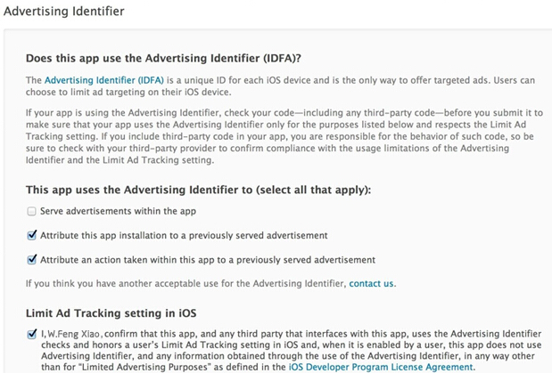

#使用IDFA通过AppStore审核

##获取IDFA广告标识符

	NSString *addId =  [[[ASIdentifierManager sharedManager] advertisingIdentifier] UUIDString];
	
IDFA是用系统存储的，但是在下面几种情况会重置广告标识符，因此最好能存到keychain中。

***

* 设置程序 -> 通用 -> 还原 -> 还原位置与隐私

* 设置程序-> 通用 -> 关于本机 -> 广告 -> 还原广告标示符

***

##提交AppStore注意事项

我们经常会使用IDFA作为设备的唯一标识，然而如果使用不当就好被AppStore拒绝.

***

* serve advertisements within the app

	如果应用中使用了广告，这一项勾选。
	
* Attribute this app installation to a previously served advertisement
 
 	跟踪广告带来的安装。

* Attribute an action taken within this app to a previously served advertisement
 
 	跟踪广告带来的用户的后续行为。

* Limit Ad Tracking setting in iOS

	这一项下的内容其实就是对你的应用使用idfa的目的做下确认，只要你选择了采集idfa，那么这一项都是需要勾选的。

***
