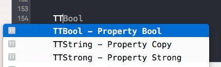
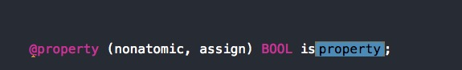
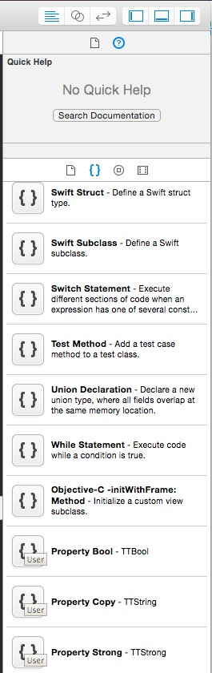
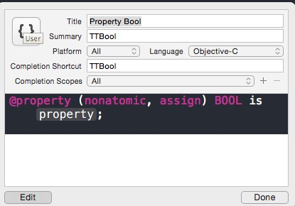

#XCode Code Snippet 代码片段

##什么是代码片段

当我们输入一段代码时，就能自动带出完整的代码，这个在日常编码时能够大幅度提高效率。如

我们只要输入*TT...* ，就能直接带出完整的代码，并且让我们填入属性名称，这个在编码过程中真的是利器啊。

##如何创建代码片段

1、我们尝试写一段代码，如下

	@property (nonatomic, assign) BOOL is<#property#>
	
2、在xcode中会自动变成这个待输入的样式

3、打开xcode右侧的 *Hide Or show the Utilities*，我们看到

4、将代码直接左键拖拽到 *Code Snippet Library *中,我们看到{}中有User字样，这就是自定义的代码片段，接下来就是设置Shortcut了，如下图：

5、这些操作完成，就可以使用了。非常爽！

##如何备份到其他电脑

	cd ~/Library/Developer/Xcode/UserData/CodeSnippets/
	
	把文件拷贝到其他电脑上，重启xcode，就可以了。

